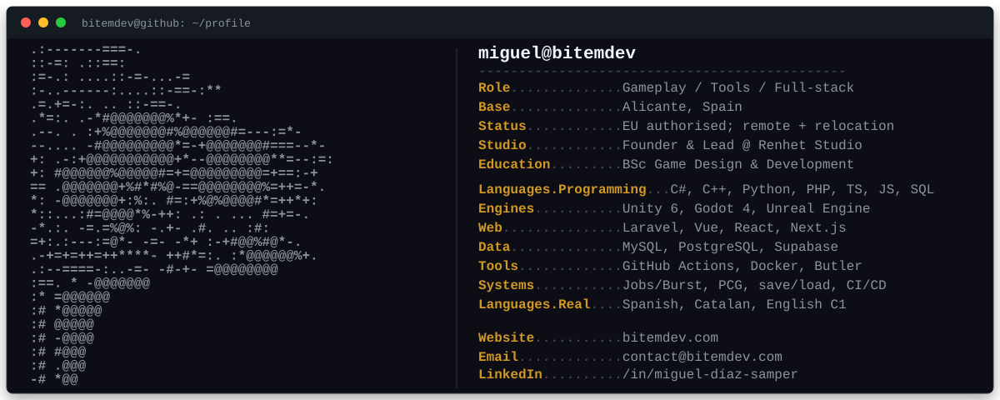

  

  <a href="https://www.bitemdev.com/">Portfolio</a> ·
  <a href="https://www.linkedin.com/in/miguel-diaz-samper/">LinkedIn</a> ·
  <a href="https://bitem.itch.io/">itch.io</a> ·
  <a href="https://x.com/bitemgamedev">X</a> ·
  <a href="mailto:contact@bitemdev.com">Email</a>

## About me

I'm a gameplay, tools and full-stack developer from Alicante, Spain. I mainly build gameplay systems, developer tooling and production web applications with Unity, C#, Laravel and TypeScript.

- Founder and Lead Programmer at **Renhet Studio**, leading an eight-person multidisciplinary team.
- Currently open to remote work and relocation, with EU work authorisation.
- Native Spanish and Catalan speaker with Cambridge C1 Advanced English.
- BSc in Video Game Design and Development from Universitat Jaume I, with an Academic Excellence Award.

  
<strong>Experience</strong>

   

### Tierra, Techo, Trabajo APS - Full-Stack Developer Intern

Building a Laravel, Inertia/Vue, TypeScript, Tailwind and MySQL CRM with role-aware dashboards, multilingual content, server-side authorization and automated Instagram Graph API ingestion. The project includes broad PHPUnit coverage and production Lighthouse validation.

### Renhet Studio - Founder and Lead Programmer

Leading an eight-person studio across design, production, art, audio, composition and marketing. I own gameplay, tools, engine integration and build systems, and built the studio's production Next.js platform with authenticated content management, RBAC, PostgreSQL row-level security and Google Sheets integration.

### INIT - IA3 Applied AI and Data Analysis - Game Developer and Applied AI Intern

Contributed 278 hours to an experimental LLM-driven narrative game, developing Unity gameplay, UI, centralized state, save/load, LLM evaluation utilities and stable Windows and Android builds.

  
<strong>Selected game and tools work</strong>

   

- [Unity Multimodal PCG Framework](https://github.com/bitemdev/Unity-Multimodal-PCG) - reusable Unity 6 UPM package with maze and BSP generation, Jobs/Burst mesh processing, runtime NavMesh baking, pooling, procedural audio, deterministic regeneration and JSON persistence. Its core algorithm averaged below 1 ms at 62,500 cells across 500 benchmark runs.
- [Designer Friendly Dialogue](https://github.com/bitemdev/DesignerFriendlyDialogueTool) - native node editors and runtimes for Unity and Godot built around one versioned JSON schema, with branching, typed variables, validation, localization export and safe command dispatch.
- **Renhet Studio Build Tool** - Windows tool automating self-hosted runners, exact-commit Unity and Unreal builds, artifact validation, versioned archives and private itch.io/Google Drive releases.
- [Beelze Pub](https://renhetstudio.itch.io/beelze-pub) - owned all programming for a two-week international game-jam release, including the cocktail loop, customers, dialogue, scoring, progression and resilient versioned save data.
- [Heredero del Oficio](https://bitem.itch.io/heredero-del-oficio) - commissioned educational adventure for L'Alcora City Council. Built its Ink dialogue/progression systems and minigames; the project won UJI's Audience Award for Best Video Game and Most Promising Game Award.
- [Unity Audio Engine](https://github.com/bitemdev/com.bitemdev.audio-engine) - designer-friendly Unity middleware with centralized events, pooled playback, music fades and mixer routing.
- [Narrative Spreadsheet Importer](https://github.com/bitemdev/com.bitemdev.narrative-importer) - Unity Editor pipeline that converts structured Google Sheets data into linked ScriptableObjects.

  
<strong>Selected web work</strong>

   

- [One Piece RESTful API](https://github.com/bitemdev/RESTful-API) - Laravel 13, React, Inertia and MySQL catalogue with Sanctum-protected writes, authenticated admin CRUD, Docker Compose and 52 passing PHPUnit tests with 346 assertions.
- [Renhet Studio website](https://renhetstudio.com/) - Next.js and PostgreSQL production site with role-protected publishing, comments, moderation, OAuth, signed uploads and Google Sheets service-account integration.

  Building systems for players and tools for the people who make them.

